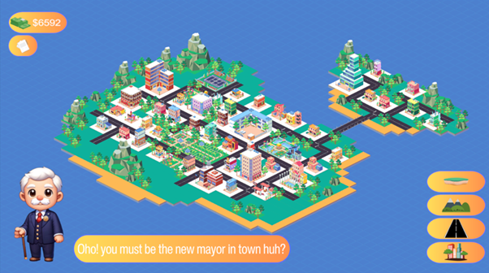
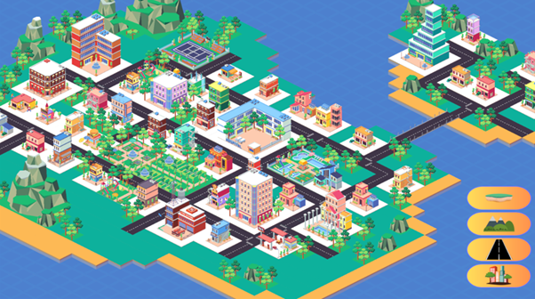
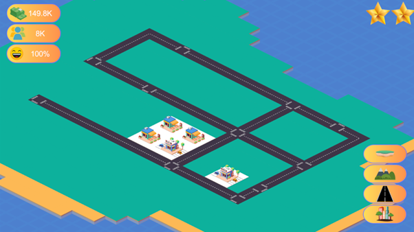

# Unity City Tycoon (2.5D City Builder)

A 2.5D city-building tycoon game developed in Unity where players design and expand their own city by placing buildings and decorations while managing income and city development.
This project was developed as part of college coursework to demonstrate practical skills in game development, system design, and Unity-based programming.

---

## Gameplay Preview

## Gameplay Overview

Players build and grow a city by placing structures and decorative elements. As the city develops, it generates passive income and improves its overall rating.

The game focuses on:

* Strategic placement
* City development progression
* Economic scaling
* Visual city growth in a 2.5D environment

---

## Income System

* Passive income is generated every minute.
* Income scales based on overall city development.
* More buildings and better city progression increase earnings.

This system demonstrates time-based logic and scalable economy balancing.

---

## City Rating System

* The city rating increases depending on the number of decorations and development level.
* Higher ratings reflect better city planning and progression.
* Rating directly influences income growth potential.

---

## Building & Placement System

* Players can place buildings and decorative objects within the city.
* Objects are instantiated dynamically using Unity.
* Designed within a 2.5D visual environment for depth and structure.

---

## UI System

The game includes a dynamic user interface that displays:

* Current money
* City rating

UI updates in real time based on player actions and income progression.

---

## Technologies Used

* Unity Engine
* C#
* Unity UI System
* Third-party Unity Asset Store assets (used for graphics)

---

## Project Structure

The repository includes only essential Unity folders:

* `Assets/`
* `Packages/`
* `ProjectSettings/`
* `.gitignore`

Temporary folders such as `Library/`, `Temp/`, and `Logs/` are excluded.

---

## Notes

Graphics were created using purchased Unity Asset Store assets and are included for project demonstration purposes only.

